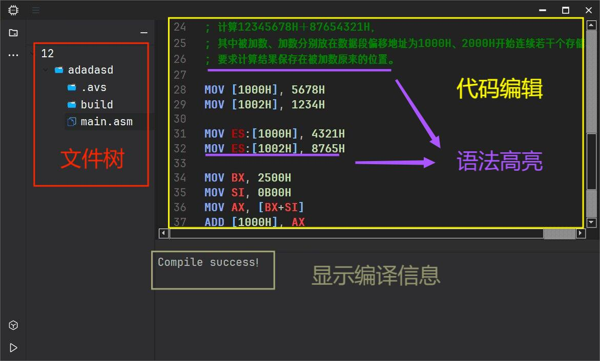
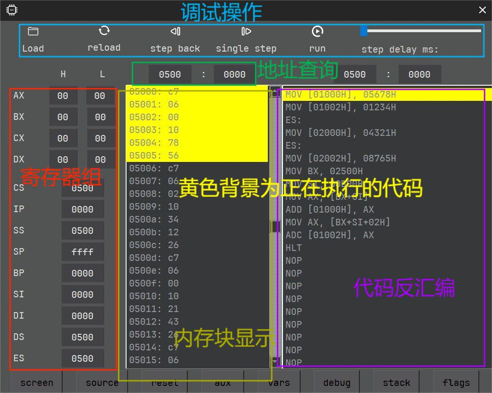
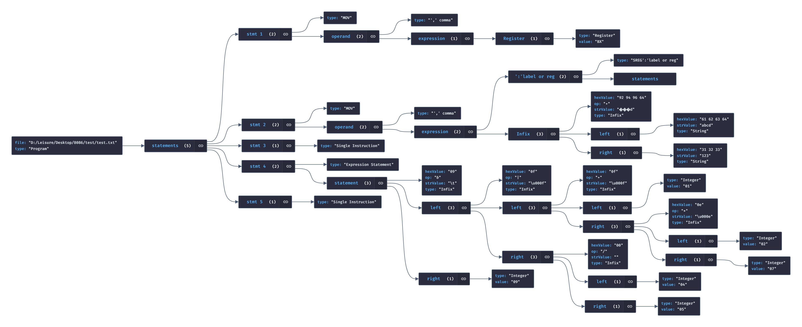

# 更新
<!-- ## 2024/03/23
汇编虚拟仿真模拟器(assembler virtual simulator) - Rename: ASMVS -> AVS8086 -->

# 环境
- ***C++ 20***
- ***Qt 6.5.3***
- ***Cmake 3.27.7***
- ***MinGW 11.2.0***

# AVS8086
> 先展示当前进展效果，后续更多内容随着开发再更新

## 主界面

## 虚拟机（模拟器）界面

## 抽象语法树

8086汇编IDE（集成了编译器、反编译器、模拟器等），对标于EMU8086
